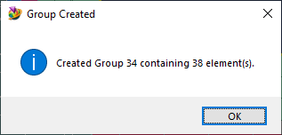
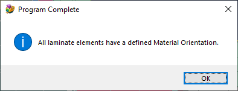

# Find Elements with No Material Direction
Easily locate laminate elements with no defined material direction.

See also: [How to use Femap Scripts](https://github.com/aaronjasso/How_to_use_Femap_Scripts) and [The List of my Femap Scripts](https://github.com/aaronjasso/My-Femap-Scripts)

---

Laminates typically require a material direction. When an analysis is run, Femap will warn the user of any laminate elements with 'default' material directions (which means they weren't defined by the user). Sometimes they can be hard to locate in the model, so this program simplifies the process. It checks all laminate elements and if any are found with default material orientations, it creates a group and adds the affected elements.

If the check doesn't find any laminate elements with default orientations, a popup informs the user and the program terminates.

